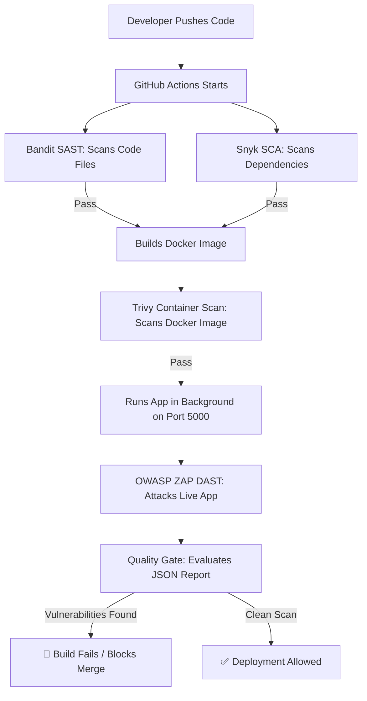

# 🛡️ Secure Stream: Automated DevSecOps Pipeline

Welcome to the **Secure Stream** repository! This project is an intentionally vulnerable Flask web application packaged inside Docker and integrated with a modern, multi-layered **GitHub Actions CI/CD pipeline**. 

The main purpose of this project is to demonstrate **DevSecOps (Development + Security + Operations)**: automatically scanning code, dependencies, containers, and running applications for security bugs before they can be deployed to production.

---

## 🏗️ How the Security Pipeline Works (The Flow)

Every time code is pushed to this repository, GitHub automatically spins up a runner to execute these security checks in sequence:



---

## 🔍 The DevSecOps Security Stack Explained

To achieve comprehensive security coverage, this pipeline uses a defense-in-depth approach spanning four different scanning categories:

### 1. Bandit — SAST (Static Application Security Testing)
*   **Analogy**: Inspecting the structural blueprint of a building before building it.
*   **What it scans**: Your static raw python source code files (`src/app.py`) without running them.
*   **Role in your project**: It flags dangerous code patterns, specifically catching the hardcoded administrator credentials and the unsafe use of the `eval()` function in your python files.

### 2. Snyk — SCA (Software Composition Analysis)
*   **Analogy**: Checking the food ingredients list for known allergens before cooking.
*   **What it scans**: Your open-source package dependencies (`requirements.txt`).
*   **Role in your project**: It checks if the specific versions of Flask, Werkzeug, or Jinja2 you are importing have known public vulnerabilities (CVEs) and warns you to update them.

### 3. Trivy — Container Image Scanner
*   **Analogy**: Inspecting the shipping shipping container for cracks or contamination before loading it.
*   **What it scans**: The final built Docker image (`secure-stream-app`).
*   **Role in your project**: Even if your Python code is 100% secure, the base operating system (e.g. Alpine Linux) inside your Docker container might have old, insecure system libraries. Trivy scans the Docker filesystem layers to find these OS-level vulnerabilities.

### 4. OWASP ZAP — DAST (Dynamic Application Security Testing)
*   **Analogy**: Hiring a physical lockpicker to try and break into the building once the doors are open and the app is running.
*   **What it scans**: The live, running Flask container on `http://localhost:5000` over the network.
*   **Role in your project**: ZAP uses `openapi.yaml` to discover and attack `/search` and `/login` with real HTTP payloads. It successfully detects the active SQL Injection vulnerability and remote command execution under runtime conditions.

---

## ⚡ The Vulnerabilities Explained (In Simple Words)

Our Flask application contains three intentional security weaknesses. Here is how they work and why they are dangerous:

### 1. SQL Injection (SQLi)
*   **Where**: `/search?q=`
*   **The Code**: `raw_query = f"SELECT * FROM users WHERE username = '{query}'"`
*   **The Problem**: User input (`query`) is inserted directly into the database command using string formatting.
*   **The Threat**: An attacker can type `' OR '1'='1` in the search bar. The database evaluates this to `TRUE` for all records, printing out the entire database content (such as private user lists) to the attacker.

### 2. Unsafe `eval()` (Remote Code Execution)
*   **Where**: `POST /login` (using the parameter `extra_command`)
*   **The Code**: `eval(extra_command)`
*   **The Problem**: Python's `eval()` function executes whatever text is passed to it as active python code.
*   **The Threat**: If an attacker accesses this endpoint, they can send a command like `__import__('os').system('rm -rf /')` to delete files or run malicious terminal commands directly inside the application server.

### 3. Hardcoded Credentials
*   **Where**: `POST /login`
*   **The Code**: `ADMIN_PASS = "SuperSecretPassword123!"`
*   **The Problem**: Password strings are written directly inside the source code files.
*   **The Threat**: Anyone who has access to read the repository (like external contributors or if the repo is leaked) can read the administrator password and hijack the server.

---

## 🚦 The Quality Gate (How We Block Vulnerable Builds)

We do not just scan; we **enforce** security. In the pipeline step `Evaluate Scan Results`, a custom bash script processes ZAP's JSON scan output (`report.json`):

1.  It counts the number of alerts that have a severity of **Medium**, **High**, or **Critical** (risk code 2 or higher).
2.  If it finds **even one** medium/high bug, it prints:
    `FAILING PIPELINE: Found X Medium/High/Critical issues.`
3.  It exits with code `1`. This tells GitHub Actions that the build has failed, which **blocks developers from merging this branch** until the code is fixed.

---

## 📊 Viewing the Security Report

When the pipeline runs:
1.  ZAP outputs an interactive **HTML report** (`report.html`).
2.  The workflow uploads this file as a run artifact named `zap-reports`.
3.  You can download the zip file from the bottom of your GitHub Actions run page, extract it, and open `report.html` in your web browser to see:
    *   An interactive summary of all vulnerabilities categorized by risk level.
    *   The exact HTTP Request payload ZAP sent to exploit the vulnerability.
    *   The HTTP Response received from the server containing the exploit proof.

---

## 🛠️ How to Run the Scan Locally

If you want to run the application and scan it manually on your own computer:

### 1. Build and Run the Flask App
```bash
# Build the Docker image
docker build -t secure-stream-app .

# Run the app in background on port 5000
docker run -d -p 5000:5000 --name flask-app secure-stream-app
```

### 2. Run the ZAP Scan
```bash
docker run --user root --rm --network host \
  -v $(pwd):/zap/wrk/:rw \
  ghcr.io/zaproxy/zaproxy:stable \
  zap-api-scan.py -t /zap/wrk/openapi.yaml -f openapi -r report.html -J report.json
```
This generates `report.html` in your current directory, which you can open and read.