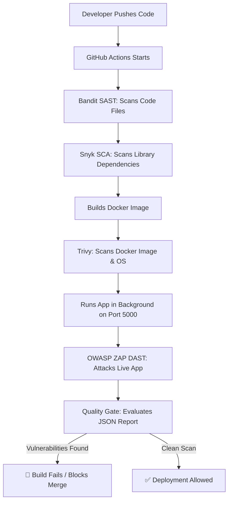

# 🛡️ Secure Stream: Automated DevSecOps Pipeline

Welcome to the **Secure Stream** repository! This project is an intentionally vulnerable Flask web application packaged inside Docker and integrated with a modern **GitHub Actions CI/CD pipeline**. 

The main purpose of this project is to demonstrate a full **DevSecOps (Development + Security + Operations)** pipeline: automatically scanning code, dependencies, containers, and running applications for security bugs before they go live.

---

## 🏗️ How the Security Pipeline Works (The Flow)

Every time code is pushed to this repository, GitHub automatically executes these security checks in sequence:



---

## 🔍 The 4 Security Tools Explained (In Simple Words)

To achieve complete coverage, this pipeline uses a defense-in-depth approach covering code, packages, containers, and runtime:

### 1. Bandit — SAST (Static Application Security Testing)
*   **Analogy**: Inspecting the structural blueprint of a building before building it.
*   **How it works**: Bandit scans the static raw source code files (`src/app.py`) without running them. It looks for known dangerous code patterns.
*   **What it catches here**: Hardcoded passwords (`ADMIN_PASS`) and the unsafe use of the `eval()` function.

### 2. Snyk — SCA (Software Composition Analysis)
*   **Analogy**: Checking the expiration dates and quality of the raw ingredients before you cook.
*   **How it works**: Snyk scans your dependencies listed in `requirements.txt` (like Flask, Werkzeug, etc.). It checks if the libraries you are using have known, published vulnerabilities.
*   **What it catches here**: Outdated versions of Flask or Jinja2 that have known security flaws.

### 3. Trivy — Container Security Scanning
*   **Analogy**: Checking the shipping box or container of the food to ensure it's not damaged or contaminated.
*   **How it works**: Trivy scans the compiled **Docker image** (including the base Linux OS, like Alpine or Ubuntu, and installed system packages) for known vulnerabilities.
*   **What it catches here**: Vulnerabilities in the Alpine Linux base OS or Python interpreter inside the container.

### 4. OWASP ZAP — DAST (Dynamic Application Security Testing)
*   **Analogy**: Hiring a physical lockpicker to try and break into the building once the doors are open.
*   **How it works**: ZAP launches real network attacks against the live, running Flask container on `http://localhost:5000`. It acts as an external hacker sending malicious inputs into search fields and forms to see if the server leaks data.
*   **What it catches here**: SQL Injection on the search route (`/search`) and remote code execution on login (`/login`).

---

## ⚡ The Vulnerabilities Present (In Simple Words)

Our Flask application contains three intentional security weaknesses to test our scanners:

1.  **SQL Injection (SQLi)** (`GET /search?q=`): Direct query concatenation allows an attacker to type `' OR '1'='1` to bypass filters and dump the entire users table database.
2.  **Unsafe `eval()` (Remote Code Execution)** (`POST /login` via `extra_command`): Evaluates text input directly as Python code, allowing hackers to run terminal commands inside the container.
3.  **Hardcoded Credentials** (`POST /login`): Plaintext admin password stored inside code, exposing it to anyone with repository access.

---

## 🚦 The Quality Gate (How We Block Vulnerable Builds)

We do not just scan; we **enforce** security. In the pipeline step `Evaluate Scan Results`, a custom bash script processes ZAP's JSON scan output (`report.json`):

1.  It counts the number of alerts that have a severity of **Medium**, **High**, or **Critical** (risk code 2 or higher).
2.  If it finds **even one** medium/high bug, it prints:
    `FAILING PIPELINE: Found X Medium/High/Critical issues.`
3.  It exits with code `1`. This tells GitHub Actions that the build has failed, which **blocks developers from merging this branch** until the code is fixed.

---

## 📊 Viewing the Security Report

When the pipeline runs:
1.  ZAP outputs an interactive **HTML report** (`report.html`).
2.  The workflow uploads this file as a run artifact named `zap-reports`.
3.  You can download the zip file from the bottom of your GitHub Actions run page, extract it, and open `report.html` in your web browser to see the exact HTTP requests and response payloads ZAP used to exploit the vulnerabilities.

---

## 🛠️ How to Run the App & ZAP Scan Locally

If you want to run the application and scan it manually on your own computer:

### 1. Build and Run the Flask App
```bash
# Build the Docker image
docker build -t secure-stream-app .

# Run the app in background on port 5000
docker run -d -p 5000:5000 --name flask-app secure-stream-app
```

### 2. Run the ZAP Scan
```bash
docker run --user root --rm --network host \
  -v $(pwd):/zap/wrk/:rw \
  ghcr.io/zaproxy/zaproxy:stable \
  zap-api-scan.py -t /zap/wrk/openapi.yaml -f openapi -r report.html -J report.json
```
This generates `report.html` in your current directory, which you can open and read.